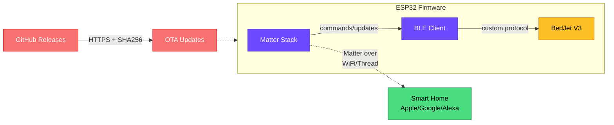

# BedJet Matter Bridge

ESP32 firmware that bridges BedJet V3 climate system to Matter smart home standard.

## Features

- **Matter Integration** — Exposes BedJet as both Thermostat and FanControl entities
- **Thread Support** — Native Matter over Thread support on ESP32-C6/H2
- **Automatic OTA Updates** — Downloads and installs firmware from GitHub Releases
- **SHA256 Verification** — Secure update mechanism with hash validation
- **Clock Sync** — Automatic time synchronization every 6 hours
- **Web Flasher** — Flash directly from browser using Web Serial API

## Quick Start

### 1. Prerequisites

- ESP-IDF v5.2.2 or later
- Python 3.8+
- Chrome/Edge browser (for web flasher)
- ESP32 board (recommended: ESP32-C6 for Thread support)

### 2. Clone and Build

Run these commands:

```bash
git clone https://github.com/tfleck/bedjet-matter-bridge.git
cd bedjet-matter-bridge
```

# Set up ESP-IDF components
```bash
idf.py reconfigure
```

# Configure target chip
```bash
idf.py set-target esp32c6  # or esp32s3, esp32c3, etc.
```

# Build
```bash
idf.py build
```

# Flash
```bash
idf.py -p /dev/ttyUSB0 flash monitor
```

### 3. Web Flasher (Recommended for End Users)

Visit the web flasher at: https://tfleck.github.io/bedjet-matter-bridge/

1. Connect ESP32 via USB-C
2. Click "Install Firmware"
3. Select your chip model
4. Wait for flash to complete
5. Open serial monitor to get Matter QR code
6. Scan QR code with Apple Home / Google Home / Alexa

### 4. Matter Pairing

After flashing, the serial output will display a Matter QR code and 11-digit pairing code.

- **Apple Home**: Open Home app > Add Accessory > Scan QR code
- **Google Home**: Open Home app > Add > Set up device > Matter
- **Amazon Alexa**: Devices > + > Add Device > Other > Matter

## Hardware Requirements

| Component | Recommendation |
|-----------|----------------|
| MCU | ESP32-C6 (best for Thread), ESP32-S3 (Wi-Fi only) |
| Flash | 4MB minimum (8MB for ESP32-S3) |
| Power | 5V via USB-C or regulated 3.3V rail |
| USB-UART | CP210x or CH340 for flashing |

## Architecture


## Matter Entity Mapping

| BedJet Feature | Matter Cluster | Attribute |
|----------------|----------------|-----------|
| Operating Mode | Thermostat | SystemMode |
| Target Temp | Thermostat | OccupiedHeating/CoolingSetpoint |
| Actual Temp | Thermostat | LocalTemperature |
| Fan Speed | Fan Control | Percentage |
| Fan State | Fan Control | FanState |

## Development

### Building for Multiple Chips

The GitHub Actions workflow automatically builds for all supported ESP32 variants:

- ESP32 (Classic)
- ESP32-S2
- ESP32-S3
- ESP32-C3
- ESP32-C6 (recommended, Thread support)
- ESP32-H2 (Thread only)

### Creating a Release

1. Tag commit with version: git tag v1.0.0
2. Push tag: git push origin v1.0.0
3. GitHub Actions will:
   - Compile for all 6 chip targets
   - Generate combined binaries (bootloader + partition table + app)
   - Calculate SHA256 checksums
   - Create GitHub Release with assets
   - Deploy web flasher to GitHub Pages

### Debugging

Enable debug logging by setting CONFIG_LOG_DEFAULT_LEVEL=4 in sdkconfig.defaults.

View real-time logs:
`idf.py -p /dev/ttyUSB0 monitor`

## Troubleshooting

| Issue | Solution |
|-------|----------|
| WiFi won't connect | Check SSID/PASSWORD in protocol_examples_common.h |
| BLE won't scan | Ensure BedJet is powered on and in pairing mode |
| QR code not appearing | Press RESET on ESP32, wait 60 seconds |
| OTA fails | Verify checksum.txt hash matches downloaded binary |
| Cannot flash via web | Use Chrome/Edge; ensure USB cable supports data transfer |

## Security

- All OTA downloads use HTTPS
- SHA256 hash verification prevents tampering
- Dual-partition OTA enables safe rollback
- ESP32 secure boot v2 disabled by default (enable in sdkconfig for production)

## License

GPLv3 License - see LICENSE file for details.

## Credits

- Based on natekspencer/ha-bedjet for BedJet protocol reverse engineering
- Built with ESP-Matter v1.3
- Uses ESP Web Tools for browser flashing