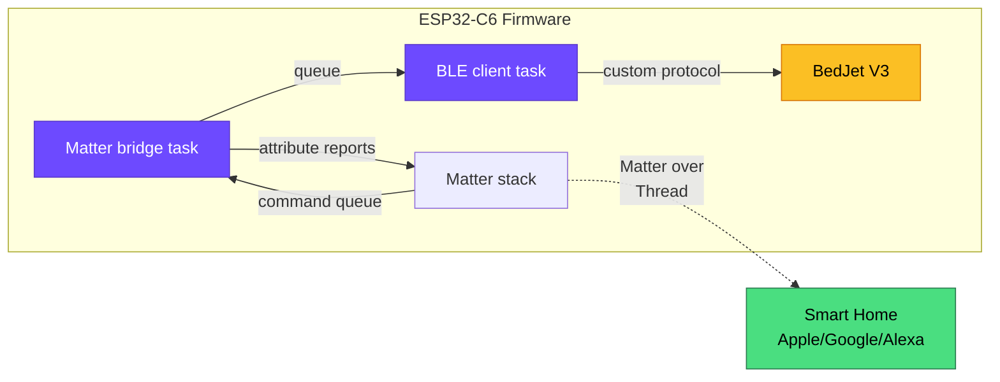

# BedJet Matter Bridge

ESP32 firmware that bridges a BedJet V3 to Matter over Thread.

The BedJet has no network interface of its own, so the ESP32-C6 speaks its Bluetooth
protocol locally and re-exposes it as two Matter devices.

## Features

- **Matter over Thread** — Native 802.15.4 via the ESP32-C6 combo radio
- **Two Matter endpoints** — a Thermostat and a Fan, as separate device types
- **Automatic BedJet discovery** — scans on first boot, remembers the device in NVS
- **Automatic reconnect** — exponential backoff when the BedJet drops the link
- **Honest fan control** — maps the BedJet's 20 discrete fan steps onto
  `PercentSetting` / `PercentCurrent` / `FanMode`
- **OTA-capable partition table** — two equal slots sized to fit the firmware
- **Browser flasher** — flash from Chrome/Edge/Opera at
  https://tfleck.github.io/bedjet-matter-bridge/web/index.html with no local toolchain

## Not implemented

Worth stating explicitly, because earlier revisions of this README claimed otherwise:

- **No OTA updater.** The partition table is *set up* for OTA, but there is no code in
  the firmware that downloads or applies an update. Use the browser flasher or
  `idf.py flash`.
- **No SHA256-verified download flow.**
- **No clock sync.** The BedJet's clock is not set; `sync_clock` was removed.
- **No rendered QR image.** The serial log prints the QR *payload* string and the
  11-digit manual pairing code. Type the manual code into your controller.
- **ESP32-C6 only.** Other chips are not built and will not build: this firmware
  requires 802.15.4.

## What you need

### Hardware

| Item | Notes |
|------|-------|
| ESP32-C6 dev board with **4MB** flash | Must be a C6. Thread needs 802.15.4, which no other ESP32 has alongside Wi-Fi. |
| USB-C cable | Must be a **data** cable, not a charge-only cable. This is the most common cause of "flashing fails". |
| BedJet V3 | Your real device, not a phone app session. See the BLE note below. |
| A Matter controller | Apple Home, Google Home or Alexa, plus a Thread border router. |

Most ESP32-C6 boards are DevKitC-1 or similar. Check yours: the silkscreen or the
espressif product page will say ESP32-C6.

### Software

Using the browser flasher? You only need Chrome, Edge, or Opera — skip this section.

To build from source you need ESP-IDF **v5.5.x**. You have it if `idf.py` resolves in
your shell.
  - Windows/VS Code: the ESP-IDF extension installs it to
    `C:\Espressif\tools` with the matching `export.ps1`.
  - Windows manual: run `C:\Espressif\tools\Microsoft.v5.5.5.PowerShell_profile.ps1`
    to load the environment (use the filename for your IDF version).
  - Linux/macOS: `source ~/esp/esp-idf/v5.5.5/esp-idf/export.sh`

### Thread border router

This firmware is a Thread Minimal Thread Device (MTD). It needs an existing Thread
network to join. You need **one** of:

- A HomePod, Apple TV 4K (3rd gen+), or Nest Hub (2nd gen+) — these are both border
  routers and Matter controllers, so one device covers both roles.
- Google Nest Hub 1st/2nd gen or Nest Wifi Pro.
- A Home Assistant installation with Thread.

You do **not** need to configure Thread by hand. Once the bridge is paired with your
controller, the controller shares its Thread credentials automatically.

---

## Flash and pair

End-user path — no toolchain. Open the flasher in Chrome, Edge, or Opera:

**https://tfleck.github.io/bedjet-matter-bridge/web/index.html**

Building from source instead? See [Development](#development).

### 1. Close the BedJet app on your phone

**Do this before anything else.** The BedJet allows exactly one BLE client. If the
BedJet phone app is connected, the bridge cannot connect, and it will not be able to
until the app releases the link. Force-quit it.

### 2. Flash the bridge

1. Open the [flasher](https://tfleck.github.io/bedjet-matter-bridge/web/index.html)
   in Chrome, Edge, or Opera.
2. Connect the ESP32-C6 over USB-C with a **data** cable.
3. Leave **Firmware version** on the latest (or pick an older release), keep the chip
   selector on **Auto-detect**, and click **Install**.

The page writes the combined firmware image, then opens a serial monitor. If the
Install button does not appear, see [Troubleshooting](#troubleshooting) — you are
probably not in a supported browser.

### 3. Get the Matter pairing code

After the board reboots, the serial monitor on the flasher page prints the pairing
information:

```
  Manual pairing code: 34970112332
  QR payload: MT:Y.K9042C00KA0648G00
```

**Write the 11-digit manual pairing code down** — it changes on every reboot. Any
115200-baud serial terminal works too (`idf.py monitor`, PuTTY, `screen`). A bridge
that is already commissioned prints no code until its commissioning window is reopened.

### 4. Watch the first boot

This is the part worth actually reading. Press `Ctrl+]` then `R` (or press the board's
RESET button) to restart and watch the log. You want to see this sequence:

```
main       : bedjet-matter-bridge starting (esp-idf 5.5.5)
bedjet_matter: Matter endpoints created: thermostat=1 fan=2
bedjet_ble : BLE task started
bedjet_ble : No saved BedJet address yet, running discovery
bedjet_ble : Scanning 10 s for a BedJet...
bedjet_ble :   candidate 'BedJet-...' rssi=-52
bedjet_ble : Discovered BedJet A4:C1:38:XX:XX:XX
bedjet_ble : BedJet address saved to NVS
bedjet_ble : Reporting in as 'BedJet-XXXX'
bedjet_ble : Link established, resolving GATT services
bedjet_ble : Subscribed to BedJet status notifications
bedjet_ble : Device flags: dual_zone=0 led=1 muted=0 units_setup=1 ...
main       : BedJet link is up; the bridge is live
bedjet_matter: BedJet mode=1 34.5C target=30.0C (device range 19.0-43.0C) fan_step=6 (35%)
main       : Commissioning window is open - this device can be paired
```

Interpretation:

| If you see | Meaning |
|------------|---------|
| `Discovered BedJet ...` then `BedJet link is up` | Working. Go to step 5. |
| `No BedJet found, retrying in 1000 ms` | Discovery failed. Close the phone app, move the board closer, and watch. It retries forever. |
| `candidate '...' rssi=-95` but no `Discovered` | Marginal signal. Move the board. |
| `Discarding N byte status notification` | A frame arrived that is not 20 bytes. See [Troubleshooting](#troubleshooting). |
| `Commissioning window is open` missing | Matter did not start. Look for an earlier error in the log. |
| No `Matter endpoints created` | NVS failed to initialise, or the node could not be created. |

The first boot takes a while — expect a 10-second BLE scan plus a minute or two for
Thread to attach to your border router.

### 5. Pair it

When the commissioning window opens, the log prints:

```
================== MATTER PAIRING INFORMATION ==================
  Manual pairing code: 34970112332
  QR payload: MT:Y.K9042C00KA0648G00
  QR URL: https://matter.c-h-amazon.com/...
==============================================================
```

**Write the 11-digit manual pairing code down** — you will not see it again unless you
reboot.

On your controller:

- **Apple Home**: Home app > **+** > Add Accessory > *More options* > enter the code.
  (Apple Home will only scan a physical QR image if it is shown on a screen; this
  firmware prints the QR payload as text, so use the manual code.)
- **Google Home**: Home app > **+** > Set up device > Matter > enter the code.
- **Alexa**: Devices > **+** > Add Device > Other > Matter > enter the code.

Thread credentials are shared automatically during pairing. If the controller asks
which Thread network to use, pick the one your border router is running.

Pair within the commissioning window (about 5 minutes by default) — after that, reboot
the board to reopen it.

### 6. Verify it works

You should see **two** devices in your controller:

- **Thermostat** — shows live ambient temperature, target temperature, and a mode control
- **Fan** — shows the fan speed as a percentage

Try:

1. **Set the mode** to Heat. The BedJet should switch to heating, and the log should
   show `SystemMode 4 -> button 0x03`.
2. **Set a temperature.** It should clamp to the BedJet's real range; if you ask for
   something out of bounds the log says `Setpoint clamped to device range`.
3. **Change the fan speed.** It will move in 5% increments (5, 10, 15 ... 100).
4. **Reboot the BedJet.** The bridge should reconnect on its own within a few seconds —
   look for `BedJet link is down; Matter attributes will go stale`, then
   `BedJet link is up; the bridge is live` again. No reboot of the bridge needed.

### 7. Re-pair or change controllers

Factory-reset Matter credentials by erasing the flash. The simplest way is to re-run
the browser flasher and choose **Erase** when it prompts. With the toolchain:

```bash
idf.py -p COM5 erase-flash
idf.py -p COM5 flash monitor
```

This also clears the saved BedJet address, so discovery runs again on next boot — which
is also how you point the bridge at a different BedJet.

---

### A note on BLE

The BedJet allows **only one BLE client at a time.** If the BedJet phone app is
connected, this bridge cannot connect until the app releases it. The reconnect loop
handles it (1s → 30s backoff), but if the bridge never connects, check whether the app
is still holding the link.

The BedJet also keeps its BLE link idle — it may drop the connection when left alone for
a while. The bridge will reconnect by itself.

## Hardware Requirements

See [What you need](#what-you-need) at the top. Summary:

| Component | Requirement |
|-----------|-------------|
| MCU | ESP32-C6 (802.15.4 required for Thread) |
| Flash | 4MB, DIO mode |
| Power | 5V via USB-C or regulated 3.3V rail |

### Flash layout and OTA headroom

`partitions.csv` gives both OTA slots the same size so a future OTA updater can swap
them:

| Partition | Offset | Size |
|-----------|--------|------|
| `nvs` | 0x9000 | 24 KB |
| `otadata` | 0xF000 | 8 KB |
| `phy_init` | 0x11000 | 4 KB |
| `ota_0` | 0x20000 | 0x1F0000 (1986 KB) |
| `ota_1` | 0x210000 | 0x1F0000 (1986 KB) |

The firmware is currently ~0x1899E0 (1575 KB), so **about 21% of each slot is free** —
comfortable headroom for a future OTA updater or the feature work above. For production
hardware with more to add, an 8MB part gives much more room, using:

```
nvs,      data, nvs,     0x9000,  0x6000,
otadata,  data, ota,     0xF000,  0x2000,
phy_init, data, phy,     0x11000, 0x1000,
ota_0,    app,  ota_0,   0x20000, 0x300000,
ota_1,    app,  ota_1,   0x320000,0x300000,
```

and set `CONFIG_ESPTOOLPY_FLASHSIZE_8MB=y`.

## Architecture


```mermaid
graph LR
    subgraph ESP32 [ESP32-C6 Firmware]
        direction TB
        Bridge[Matter bridge task] -->|attribute reports| Matter[Matter stack]
        Matter -->|command queue| Bridge
        Bridge -->|queue| BLE[BLE client task]
        BLE -->|custom protocol| BedJet[BedJet V3]
    end

    Matter -.->|Matter over<br/>Thread| SmartHome[Smart Home<br/>Apple/Google/Alexa]

    classDef esp fill:#6d4aff,stroke:#5b3acc,color:white;
    classDef matter fill:#4ade80,stroke:#2d7a50,color:black;
    classDef bedjet fill:#fbbf24,stroke:#d97706,color:black;

    class Bridge,BLE esp
    class BedJet bedjet
    class SmartHome matter
```

Neither task blocks the other:

- The **BLE task** is the only one that touches NimBLE connect/read/write and the
  scanner. GATT reads block on the NimBLE host task, so they must never run on the CHIP
  stack task.
- The **bridge task** owns every Matter attribute write and all mutable state. BLE
  status arrives on the NimBLE host task and is only copied into a single-slot
  overwrite queue; Matter writes arrive from the CHIP task and are only copied into a
  command queue. Neither direction calls into the other directly.

## Matter Entity Mapping

Endpoint 1 is a Thermostat (device type `0x0301`), endpoint 2 is a Fan (device type
`0x002B`). Fan Control is not a legal cluster on a Thermostat endpoint, and the
BedJet's stepped fan speed maps more clearly onto a fan device.

### Thermostat (endpoint 1)

| BedJet | Matter attribute | Notes |
|--------|------------------|-------|
| Operating mode | `SystemMode` | standby/heat/turbo/ext-heat -> Off/Heat, cool -> Cool, dry -> Dry |
| Actual temperature | `LocalTemperature` | From the status notification |
| Target temperature | `OccupiedHeatingSetpoint` | Published while heating |
| Target temperature | `OccupiedCoolingSetpoint` | Published while cooling/drying |

The BedJet has a *single* target temperature, so only the setpoint matching the current
system mode is published. Publishing both would advertise an impossible "heat to N and
cool to N" range.

### Fan (endpoint 2)

| BedJet | Matter attribute | Notes |
|--------|------------------|-------|
| Fan step 0–19 | `PercentCurrent` | `step -> (step + 1) * 5`, i.e. 5%–100% |
| Commanded speed | `PercentSetting` | Retained target; `0` means standby |
| Measured speed | `FanMode` | Off / Low / Medium / High bands |

The BedJet has no "fan off" step — step 0 is the lowest *running* speed. Stopping the
blower means going to standby, which also stops the heater. Setting `PercentSetting`
to `0` therefore turns the BedJet off, and that is logged explicitly.

Fan step <-> percent: `percent / 5 - 1`, with 1%–4% snapped up to the BedJet's minimum
of 5%.

## Development

### Build from source

```bash
git clone https://github.com/tfleck/bedjet-matter-bridge.git
cd bedjet-matter-bridge
idf.py build
```

`sdkconfig.defaults` pins `CONFIG_IDF_TARGET="esp32c6"`, so a fresh clone needs no
`set-target` step. The image is built for size (`-Os`, see
`CONFIG_COMPILER_OPTIMIZATION_SIZE`) and reports roughly:

```
bedjet_matter_bridge.bin binary size 0x1899e0 bytes.
Smallest app partition is 0x1f0000 bytes. 0x66620 bytes (21%) free.
```

#### Build caching

The Matter stack is ~2200 objects, so incremental rebuilds depend on caching:

- **ccache is on** and is detected automatically (`ccache will be used for faster
  recompilation` appears in the CMake output). The first build compiles everything;
  after that, touching `main/*.cpp` rebuilds a handful of objects and relinks in
  about 1–2 minutes.
- **Never run `idf.py fullclean` to fix a build problem.** It discards every cached
  object and turns a 1-minute rebuild into a ~40-minute one. If `build.ninja` goes
  missing, run `idf.py reconfigure` instead.
- **Changing `sdkconfig.defaults`, `CMakeLists.txt`, or anything under
  `managed_components/` changes compiler flags/inputs and invalidates ccache for the
  whole project.** Batch those edits rather than tweaking them one at a time.
- CI caches `managed_components`, the toolchain, and ccache between runs.

### Flash from source

Find your serial port first (Windows):

```powershell
Get-CimInstance Win32_SerialPort | Select-Object DeviceID
```

Or just look at the output of `idf.py flash`, which lists the ports it can see. Then:

```bash
idf.py -p COM5 flash monitor      # Linux/macOS: -p /dev/ttyUSB0
```

If flashing fails to open the port, another serial monitor is holding it — close
Arduino IDE, PuTTY, VS Code terminals, etc. Press `Ctrl+]` to exit `idf.py monitor`.

### Supported targets

ESP32-C6 only. `sdkconfig.defaults` pins the target, and the CI matrix builds just
`esp32c6`.

### CI: releases

Pushing a `v*` tag builds the firmware and publishes a GitHub Release. For **each**
firmware target it attaches the combined image **and a matching per-firmware checksum**
(`firmware_<target>_combined.bin.sha256`, coreutils format) as release assets — so
adding targets later never shares one checksum file. The web flasher lists every
release that carries a `firmware_esp32c6_combined.bin`, newest first, and defaults to
the latest; flashing needs no GitHub Actions Pages deploy.

- **Flash from the browser:** https://tfleck.github.io/bedjet-matter-bridge/web/index.html
- **Tag a release:**

  ```bash
  git tag v1.0.0
  git push origin v1.0.0
  ```

- **Manual download:** grab `firmware_esp32c6_combined.bin` (and its `.sha256`) from the
  release, then:

  ```bash
  sha256sum --check firmware_esp32c6_combined.bin.sha256
  python -m esptool --chip esp32c6 write_flash 0x0 firmware_esp32c6_combined.bin
  ```

### Debugging

Raise `CONFIG_LOG_DEFAULT_LEVEL` to 5 in `sdkconfig.defaults` (currently `3`) for
peripheral-level NimBLE and Thread logging, then rebuild:

```bash
idf.py build && idf.py -p COM5 monitor
```

The firmware also filters CHIP's own logs to errors at runtime
(`chip::Logging::SetLogFilter(chip::Logging::kLogCategory_Error)` in `main.cpp`) to
keep the boot log readable. To see Matter per-message/discovery logging, raise
`CONFIG_CHIP_LOG_DEFAULT_LEVEL` in `sdkconfig.defaults` and drop that call.

Press `Ctrl+]` to exit the monitor, `Ctrl+R` to restart the device.

You can filter the log to just this project's tags:

```bash
idf.py -p COM5 monitor | grep -E "bedjet_ble|bedjet_matter|main"
```

## Troubleshooting

### The bridge will not find the BedJet

| Symptom | Fix |
|---------|-----|
| `No BedJet found, retrying in 1000 ms` forever | Force-quit the BedJet app on your phone. It holds the only BLE slot. |
| `candidate '...' rssi=-95` but no `Discovered` | Signal is too weak. Move the board within a couple of metres. |
| No `candidate` lines at all | BedJet is off or unpowered, or your board's antenna is obstructed. |
| Found once, never again after `erase-flash` | Expected — `erase-flash` clears NVS including the saved address. |
| Connected, then `link is down` after a while | The BedJet drops idle BLE links. Normal; the bridge reconnects on its own. |

### Matter will not pair

| Symptom | Fix |
|---------|-----|
| No `Commissioning window is open` line | Matter did not start. Scroll up for an earlier error. The window lasts ~5 minutes; reboot to reopen it. |
| Controller says "no Thread networks found" | You need a Thread border router on the network. See [What you need](#what-you-need). |
| Code rejected | Manual pairing codes expire when the commissioning window closes. Reboot for a fresh code. |
| Paired but unreachable in the app | Look for `Thread attached`. If you only see `Thread detached`, the controller has not shared Thread credentials yet. |

### Build and flash problems

| Symptom | Fix |
|---------|-----|
| `xtensa-esp32-elf-gcc ... not found` | Wrong target. `sdkconfig` was gitignored but a stale copy exists — run `idf.py fullclean`, or delete `sdkconfig`. |
| `undefined reference to ble_svc_gap_init` | Someone set `CONFIG_BT_NIMBLE_ROLE_PERIPHERAL=n`. It must stay at its default `y`; see the comment in `sdkconfig.defaults`. |
| `Failed to open COM5` | Another program holds the port. Close Arduino IDE, PuTTY, other terminals. |
| Flash stalls or fails | Try a different USB cable — charge-only cables are common. |
| Boot loop, "invalid header" | The board is 8MB but `sdkconfig` says 4MB, or vice versa. Check the flash size printed by `idf.py flash`. |

### Runtime warnings

| Log line | Meaning |
|----------|---------|
| `Discarding N byte status notification` | Expected exactly 20 bytes. A different length means your BedJet firmware sends a variant this parser does not handle — note `N` and file an issue. |
| `Setpoint clamped to device range` | The controller asked outside the BedJet's reported min/max (typically 19–43°C). Working as intended. |
| `Matter command queue full` | Controllers wrote faster than the bridge could send to BLE. Harmless in practice. |
| `Command queue full, dropping 0x..` | BLE writes are not keeping up. Also harmless. |

## Security

- Matter commissioning is protected by the standard Matter attestation flow
- BLE pairing uses SMP; the host is a central only and does not accept connections
- ESP32 secure boot and flash encryption are **disabled**; enable them in `sdkconfig`
  for production hardware

## License

GPLv3 License - see LICENSE file for details.

## Credits

- BedJet protocol behaviour cross-checked against
  [natekspencer/ha-bedjet](https://github.com/natekspencer/ha-bedjet)
- Built with [esp-matter](https://github.com/espressif/esp-matter) v1.6.0
- BLE stack: [esp-nimble-cpp](https://github.com/h2zero/esp-nimble-cpp) v2.5.0